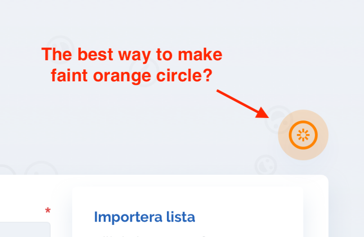

# Nectima Styling Conventions :art:

This repository is a reference for styling conventions and best practices used at Nectima AB. 

#### Contributors

- Axel Yung (Developer)
- Nicolas Lindberg (UX Designer)

## Table of Contents

1. [Introduction](#introduction)
1. [Tools](#tools)
    - [SCSS](#scss)
    - [Compilers](#compilers)
    - [Linters](#linters)
    - [IDE Extensions](#ide-extensions)
1. [Implementation](#implementation)
    - [Libraries](#libraries)
    - [Reusability v. Speed](#reusability-v-speed)
    - [Specificity v. Composability](#specificity-v-composability)
    - [Naming](#naming)
    - [Selectors](#selectors)
    - [Pseudo Elements](#pseudo-elements)
    - [!important](#nothing-is-that-important)
    - [Units](#units)
    - [Directory Structure](#directory-structure)
    - [Browser Compatibility](#browser-compatibility)
    - [Readability](#readability)
    - [Comments](#comments)

---

# Introduction

Styling complex projects is team effort that requires collaboration between multiple designers and developers. Furthermore, many of Nectima's projects are later turned over to other development teams, which must continue or improve upon our own work. This only serves to emphasize the importance of a clean, systematic and structured approach to front-end development.

This document serves as a guide to new developers (as well as a reference to all Nectima team members) of how we choose to implement styling in front-end projects. As in life, there are always exceptions to the rule, but by following these guidelines we can make reading and writing code easier, faster and more maintainable for everyone. We want to create applications that are both beautiful to look at and painless to scale. :heart:

---

# Tools :hammer_and_wrench:

## SCSS

At Nectima most projects use [SCSS](http://sass-lang.com/) in lieu of simple CSS. SCSS is a superset of CSS which means that everything you know about CSS can still be applied in SCSS code, but this extension has powerful features which make the development process faster and easier.

If you are new to SCSS or need a review, checkout these resources:

- [Sass Basics](http://sass-lang.com/guide)
- [Learn Sass In 15 Minutes (Tutorial)](https://tutorialzine.com/2016/01/learn-sass-in-15-minutes)
- [Learn the Best and Most Useful SCSS (Tutorial)](https://egghead.io/courses/learn-the-best-and-most-useful-scss)

In any given project nearly all SCSS features are used, so it's important that you have a good understanding of the language and its features.

## Compilers
(todo)

## Linters
(todo)

## IDE Extensions
(todo)

---

# Implementation

## Libraries :books:

Most projects will have third-party dependencies. In the best case, these libraries also use Sass so that importing and extending them is easy and painless.

The most common library used is Twitter's [Bootstrap](https://getbootstrap.com/). Thankfully, the Bootstrap team have adopted Scss in the project and allow for overriding default colors, sizes and breakpoints.

Before adopting a third-party library for the project that you are currently working on, consider how it will affect the project's backlog. Your teammates will thank you. 

## Reusability v. Speed :stopwatch:

All projects should start with a period of styling smaller reusable components rather than immediately focusing on developing screens. For example, add a simple design page and dedicate one or more days to writing and styling simple elements such as headers, buttons, form fields, containers, etc. This will allow you to implement styling in isolation from context and have a reference for elements and class names later in the development process.

See an example of a design page with components [here](design-page.png).

This workflow requires a little more time at the beginning of a project, but speeds up the process significantly later on. Plus having a dedicated page as a component reference enforces consistency and prevents developers from unnecessarily  restyling components.

### Using `&` :fire:
In Scss the `&` operator is an extremely powerful tool and can help to make code much easier to maintain. For example, instead of writing... 
```css
.btn-blue {
    display: inline-block;
    font-size: 1.125rem;
    width: 6rem;
    background: blue;
}
.btn-red {
    display: inline-block;
    font-size: 1.125rem;
    width: 6rem;
    background: blue;
}
```
...the `&` operator allows us to write...
```scss
.btn {
    &-blue,
    &-red {
        display: inline-block;
        font-size: 1.125rem;
        width: 6rem;
    }
    &-blue {
        background: blue;
    }
    &-red {
        background: red;
    }
}
```
This way if we ever need to change a property across all components of a particular type we only need to edit the code in a single place. There are however other alternatives to this approach include using `%placeholders` and `@mixins`.

## Specificity v. Composability :building_construction:

Strive to reuse classes as often as possible. This relates to the [Reusability v. Speed]() topic discussed earlier where reusable styles should be defined at the beginning of a project. If styles differ only slightly between components, consider composing styling from multiple classes rather than writing new classes. For example, an element with `font-size: .75rem, font-weight: 600, text-decoration: underlined` can be styled with one class...

```css
.tiny-bold-underlined {
    font-size: .75rem;
    font-weight: 600;
    text-decoration: underlined;
}
```

...or three separate ones...

```css
.tiny {
    font-size: .75rem;
}
.bold {
    font-weight: 600;
}
.underlined {
    text-decoration: underlined;
}
```

The advantage of the latter approach is that if it is necessary to style a text as bold and underlined later on, the developer only needs to add two classes to the markup without creating a new one.

So before writing new classes, first consider if the same result can be achieved by composing styles from existing classes and when writing new classes try to consider writing them in a way which can be reused elsewhere.

## Naming :neckbeard:

#### Filenames :file_folder:

Filenames should be in English and all (lowercase) kebab-case for all stylesheets (`my-style-sheet.scss`). If the stylesheet is intended to be used as a partial it should be prefixed by an underscore (`_partial-stylesheet.scss`).

#### Selector Names :name_badge:
All selector names should be in English and all (lowercase) kebab-case across the entire project. The only exception to this rule is when it is necessary to override existing styling by third-party libraries.

```css
// GOOD
.class-name {
    ...
}

// BAD
.className,
.ClassName,
.class_name,
.Class-Name,
.klass-namn {
    ...
}
```

Try to extend upon existing class name conventions. If a class name uses an abbreviation it should be uniform across the project. For example, **Bootstrap** uses `btn` as an abbreviation for "button." If you use **Bootstrap** in a project and write a custom class name for a button element it should follow this convention as well.

Because special button identifiers are prefixed by `btn` (as in `btn-primary` or `btn-sm`) you should do this:

```css
// GOOD
.btn-cool {
    ...
}

// BAD
.cool-btn,
.button-cool {
    ...
}
```

However, when using abbreviations consider readability over brevity. For example, very few could guess that `tp-hdr-lndg-pg` actually refers to "top header landing page."

## Selectors :point_left:

Our styling is written using primarily element and class names. In rare cases we use ids, but this makes overriding selectors much more difficult. If more specificity is required consider using one of the following lesser known selectors:

| Selector              | Example               | Description
| --                    | --                    | --
| element \> element                   | div \> p              | Selects all `<p>` elements where the parent is a `<div>` element
| element + element       | div + p               | Selects all `<p>` elements that are placed immediately after `<div>` elements
| element1 ~ element2     | div ~ p               | Selects every `<ul>` element that are preceded by a `<p>` element
| \[attribute\] | \[target\] | Selects all elements with a target attribute
| \[attribute=value\] | \[target=_blank\] | Selects all elements with target="_blank"
| \[attribute~=value\] | \[title~=flower\] | Selects all elements with a title attribute containing the word "flower"
| \[attribute\|=value\] | \[lang\|=en\] | Selects all elements with a lang attribute value starting with "en"
| \[attribute^=value\] |  a\[href^="https"\] | Selects every `<a>` element whose href attribute value begins with "https"
| \[attribute$=value\] |  a\[href$=".pdf"\] | Selects every `<a>` element whose href attribute value ends with ".pdf"
| \[attribute*=value\] |  a\[href*="w3schools"\] | Selects every `<a>` element whose href attribute value contains the substring "w3schools"
| :first-child          | p:first-child         | Selects every `<p>` element that is the first child of its parent
| :nth-child(n)         | p:nth-child(3)        | Selects every `<p>` element that is the third child of its parent
| :nth-last-child(n)    | p:nth-last-child(2)   | Selects every `<p>` element that is the second to last child of its parent
| :last-child           | p:last-child          | Selects every `<p>` element that is the last child of its parent
| :first-of-type        | p:first-of-type       | Selects every `<p>` element that is the first `<p>` element of its parent
| :nth-of-type(n)       | p:nth-of-type(2)      | Selects every `<p>` element that is the second `<p>` element of its parent
| :nth-last-of-type(n)  | p:nth-last-of-type(3) | Selects every `<p>` element that is the third to last `<p>` element of its parent
| :last-of-type         | p:last-of-type        | Selects every `<p>` element that is the last `<p>` element of its parent

For a complete reference look to [W3 Schools](https://www.w3schools.com/cssref/css_selectors.asp).

## Pseudo Elements
When it comes to writing markup, **less is more**. For this reason we encourage using pseudo elements (`::before` and `::after`) over writing unecessary empty markup. Candidates for pseudo elements include basic shapes, lines, background images and other elements whose contents are static.

For example, consider the following scenario. We want to add a basic circle shape to sit behind a `<svg>` icon:



We could use an empty `html` element and position it absolutely inside of a container that it shares with the `svg` element:

```html
<div class="icon-container">
    <svg class="icon"></svg>
    <div class="icon-background"></div>
<div>
```

```scss
.icon-container {
    position: relative;
    .icon-background {
        position: absolute;
        top: 50%;
        left: 50%;
        transform: translate(-50%, -50%);
        height: 2.5rem;
        width: 2.5rem;
        border-radius: 1.25rem;
        background: $faint-orange;
    }
}
```

But we can achieve the same result by using a pseudo element on `<svg>` :

```html
<svg class="icon"></svg>
```

```scss
.icon {
    position: relative;
    &::after{
        display: block;
        content: "";
        // same as above
        position: absolute;
        top: 50%;
        ...
    }
}
```

The second solution is preferable here, because it removes the need for marking up the container and the extra empty element. As an added bonus we can reuse the `icon` class whenever we need the same circle background by simply adding an additional class. Nice!

## Nothing is that `!important` :hankey:

There is only one use case where `!important` is necessary, namely overriding inline styles set dynamically. This is usually a result of a third-party javascript library which dynamically sets inline styles as part of its functionality.

Overriding styles can be done by adding additional selectors to any block of code and therefore `!important` is unnecessary. **Don't use `!important`**.

## Units :straight_ruler: 

When working with font sizes, spacing and small increments in general prefer using `rem` to `px`. Using `rem` is preferable since it is relative to the root element (or `<html>`). For example, if we want the default font-size to be `16px` across the entire project:

```css
html {
    font-size: 16px;
}
```
Then we can use this standard elsewhere:
```css
.selector {
    font-size: 1rem;        // 16px
    padding: 1.5rem;        // 24px
    margin-bottom: .75rem;  // 12px
}
```

However, `px` can be preferred for setting the width/height of bigger elements since the scale of `rem` can be hard to visualize and not all measurements will equal a multiple of `1rem`.

Avoid leading zeros (i.e. write `0.75rem` as `.75rem`).

## Directory Structure :file_cabinet:

One of the many strengths of using Sass is that it allows us to break up our style sheets into smaller pages. These pages are usually grouped according to their scope (global, components, scope) or their purpose (variables, placeholders, mixins). For example a typical directory structure might look like the following:

```
styling
|-- index.scss
|-- components
    |-- _buttons.scss
    |-- _accordions.scss
    |-- _modals.scss
|-- pages
    |-- _landing.scss
    |-- _list-view.scss
    |-- _profile.scss
|-- foundation
    |-- _base.scss
    |-- _type.scss
    |-- _variables.scss
|-- utilities
    |-- _mixins.scss
    |-- _placeholders.scss
    |-- _functions.scss
```

`index.scss` should in turn follow a similar structure when importing all the files:

```scss
// ==== COMPONENTS ====
@import "./components/buttons";
@import "./components/accordions";
@import "./components/modals";

// ====== PAGES =======
@import "./pages/landing";
@import "./pages/list-view";

// ...
```

## Browser Compatibility :computer:

Unfortunately most of our projects require legacy browser compatibility which means that we are prohibited from using many modern CSS properties. These include...

* `flex`
* `object-fit`
* `css-grid`

As a rule of thumb, we try to be compatibile with at least IE11, but this will vary depending on the project.

Furthermore, browsers will have different names for the same property (`placeholder`, `scrollbar`, `transition`, etc). But in most cases we can handle this issue easily using compilation tools such as [autoprefixer](https://github.com/postcss/autoprefixer).

## Readability :open_book:

As mentioned in the introduction, our projects should be both visually pleasing, but also easy to scale. We're developing both for the finished project as well as for our colleagues and other developers, which means that we should always assume that someone else will have to one day read our code.

Examples of formatting which should be avoided include:

1. One-liners
```css
.btn, .header, h4 { font-size: $p-size; color: $text-color; border: 1px solid $brand-secondary; }
```
2. Overly abbreviated class names
```css
.spr-abbr-clss-nm {  // what does this refer to?
    ...
}
```
3. Lazy indentation
```css
.parent {
padding: 1rem;
.child
position: absolute;
}
```

## Comments :pencil:
(todo)
